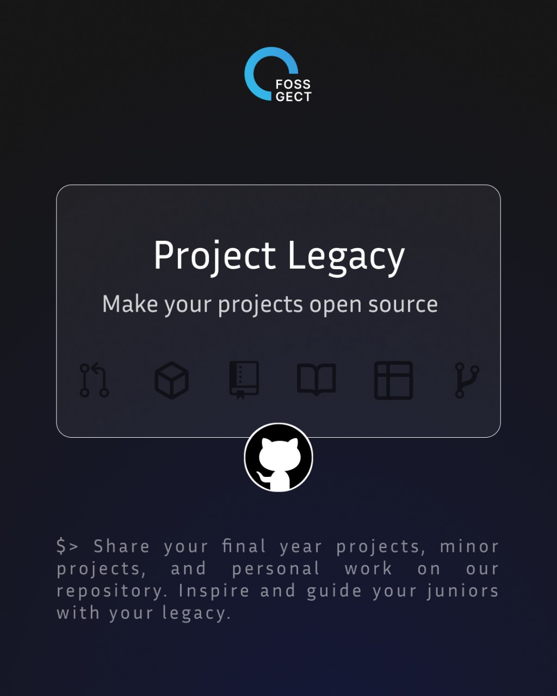

# Project Legacy

## What is Project Legacy?

Project Legacy is a FOSS (Free and Open Source Software) club initiative aimed at creating a centralized repository of projects that are affiliated with open-source principles. This repository is designed to serve as a valuable resource for students passionate about contributing to open-source projects and for those seeking references for their research or project development.  Whether you're a seasoned coder or a curious beginner, this is your gateway to contribute to and benefit from a treasure trove of knowledge and creativity. Dive in, explore, and be a part of something bigger!

## Aim

The primary aim of Project Legacy is to:
- Foster a collaborative environment where students from various departments can contribute to and benefit from open-source projects.
- Provide a structured repository categorized by departments to make it easier for students to find relevant projects.
- Encourage students to participate in open-source development and contribute their own projects.

## Your Contributions
For ease of categorization of similar projects, we have divided the repo into different folders corresponding to each department at GECT. We welcome contributions from students across the following:
- 📡 ECE (Electronics and Communication Engineering)
- ⚡ EEE (Electrical and Electronics Engineering)
- 💻 CSE (Computer Science and Engineering)
- 🔧 MECH (Mechanical Engineering)
- 🏗️ CIVIL (Civil Engineering)
- 🏭 PRODUCTION (Production Engineering)
- ⚗️ CHEMICAL (Chemical Engineering)
- 🏛️ ARCH (Architecture)

### How to Contribute

1. **🚀 Fork the Repository**: 
    - Go to the GitHub page of this repository and click the "Fork" button at the top right. This will create a copy of the repository under your GitHub account.

2. **🔄 Clone the Repository**: 
    - Open your terminal and type:
        ```bash
        git clone https://github.com/your-username/Project-Legacy.git
        ```
    - Replace `your-username` with your GitHub username.

3. **🌿 Create a New Branch**:
    - Navigate to the repository directory in your terminal and type:
        ```bash
        git checkout -b your-branch-name
        ```
    - Replace `your-branch-name` with a name describing your contribution.

4. **📂 Add Your Project**: 
    - Add your project files to the appropriate department folder in the cloned repository on your computer.

5. **✅ Commit Your Changes**: 
    - In your terminal, type:
        ```bash
        git add .
        git commit -m "Add project for [Department] - [Project Name]"
        ```
    - Replace `[Department]` with your department and `[Project Name]` with your project name.

6. **⬆️ Push to GitHub**:
    - Type:
        ```bash
        git push origin your-branch-name
        ```

7. **🔍 Create a Pull Request**: 
    - Go to the original repository on GitHub, click the "Compare & pull request" button, write a brief description of your changes, and submit the pull request.

## Benefits

- **Knowledge Sharing**: Gain access to a wealth of knowledge and resources from different departments.
- **Collaboration**: Work with peers from various disciplines, enhancing your collaborative skills.
- **Skill Development**: Improve your coding, documentation, and project management skills.
- **Recognition**: Contribute to a recognized initiative and enhance your portfolio.

## How to Use This Repository

1. **Browse Projects**: Navigate through the department folders to explore various projects.
2. **Clone a Project**: Clone any project repository to your local machine for further development or study.
    ```bash
    git clone https://github.com/FOSS-Club/Project-Legacy.git
    ```

## Getting Started

To get started with contributing or using the projects in this repository, follow the instructions provided above. We encourage active participation and look forward to seeing your contributions!

## Contact Us

If you have any questions or need further assistance, feel free to reach out to us through our [Instagram](https://www.instagram.com/fossgect?utm_source=ig_web_button_share_sheet&igsh=ZDNlZDc0MzIxNw==).

---
